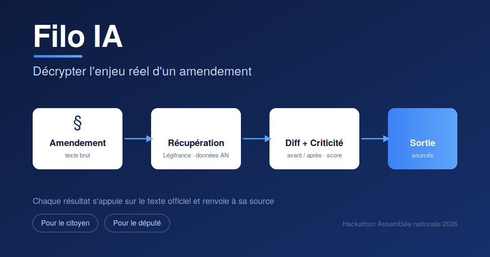

### Nom du défi
Filo IA — Décrypter l'enjeu réel d'un amendement

### Description courte
Filo IA rend lisible, pour le citoyen comme pour le député, ce qu'un amendement, un article ou un projet de loi change vraiment. Pour chaque élément : un comparatif avant/après en langage clair, l'identification de qui et quoi est concerné, et un score de criticité — le tout sourcé et vérifiable sur les textes officiels.

### Porteur
Filo IA - Florent M & Jessy D

### Description longue
Un projet de loi (PPL) est souvent illisible pour qui n'est pas juriste. Impossible, pour un citoyen comme pour un député qui doit trier des centaines d'amendements pour des dizaines d'articles, de saisir rapidement ce qui change réellement et l'ampleur de l'enjeu. Cette barrière nuit à la fois à la compréhension citoyenne de l'action parlementaire et à l'efficacité du travail législatif.

**Ce que fait Filo IA.** L'outil prend un amendement et en restitue quatre éléments, chacun ancré sur le texte officiel :

1. **Le diff avant / après en langage clair** — ce que dit la loi aujourd'hui face à ce qu'elle dirait si le PPL était adopté, reformulé dans un français accessible.
2. **Qui et quoi est concerné** — extraction des populations, secteurs et acteurs impactés par la modification.
3. **Un score de criticité multi-critères** — Le projet de loi touche-t-il un principe fondamental ? un large public ? un enjeu budgétaire important ? Une grille transparente hiérarchise l'enjeu réel plutôt que de le résumer.
4. **Les arguments pour / contre** (optionnel) — synthétisés à partir du débat parlementaire lui-même.

L'implémentation d'un chatbot supplémentaire sur la page des amendements est envisagé en V2.

### Image principale

### Contributeurs
- Florent Mary
- Jessy Dulche

### Ressources utilisées
Cochez les ressources utilisées en remplaçant `[ ]` par `[x]`.

- [x] `openfisca-france-parameters` — Base de données de paramètres ✺ OpenFisca
- [x] `an-dossiers-legislatifs` — Dossiers législatifs de l'Assemblée nationale (législature courante) ✺ Assemblée nationale
- [x] `an-amendements-xvii` — Amendements déposés à l'Assemblée nationale (législature actuelle) ✺ Assemblée nationale
- [ ] `an-comptes-rendus` — Comptes rendus de la séance publique à l'Assemblée nationale (législature actuelle) ✺ Assemblée nationale
- [ ] `an-votes-xvii` — Votes des députés (législature actuelle) ✺ Assemblée nationale
- [ ] `an-deputes-en-exercice` — Députés en exercice ✺ Assemblée nationale
- [ ] `an-deputes-historique` — Historique des députés ✺ Assemblée nationale
- [ ] `an-deputes-senateurs-ministres-par-legislature` — Députés, sénateurs et ministres d'une législature ✺ Assemblée nationale
- [ ] `an-agenda-reunions` — Agenda des réunions à l'Assemblée nationale (législature courante) ✺ Assemblée nationale
- [ ] `an-questions-gouvernement` — Questions de l'Assemblée nationale au Gouvernement ✺ Assemblée nationale
- [ ] `an-questions-gouvernement-ecrites` — Questions écrites de l'Assemblée nationale au Gouvernement ✺ Assemblée nationale
- [ ] `an-questions-gouvernement-orales` — Questions orales de l'Assemblée nationale au Gouvernement ✺ Assemblée nationale
- [x] `premier-ministre-legi` — Codes, lois et règlements consolidés ✺ Premier ministre
- [x] `premier-ministre-dole` — Dossiers législatifs Légifrance ✺ Premier ministre
- [ ] `premier-ministre-jorf` — Édition ''Lois et décrets'' du Journal officiel ✺ Premier ministre
- [ ] `senat-dispositifs-textes` — Dispositifs des textes déposés ou adoptés au Sénat ✺ Sénat
- [ ] `senat-dossiers-legislatifs` — Dossiers législatifs du Sénat ✺ Sénat
- [ ] `senat-amendements` — Amendements déposés au Sénat ✺ Sénat
- [ ] `senat-senateurs` — Sénateurs ✺ Sénat
- [ ] `senat-questions-gouvernement` — Questions orales et écrites du Sénat au Gouvernement ✺ Sénat
- [ ] `senat-comptes-rendus` — Comptes rendus de la séance publique au Sénat ✺ Sénat
- [x] `an-et-co-database-regroupement-toutes-donnees` — Base de données unifiée Parlement / Législation / Service Public ✺ Assemblée nationale & communauté
- [x] `an-et-co-serveur-mcp-regroupement-toutes-donnees` — Serveur MCP  - Accès unifié Parlement / Législation / Service Public ✺ Assemblée nationale & communauté
- [x] `an-et-co-api-regroupement-toutes-donnees` — API - Accès unifié Parlement / Législation / Service Public ✺ Assemblée nationale & communauté
- [ ] `legiwatch-api-parlement` — API Parlement ✺ LegiWatch
- [ ] `legiwatch-database-parlement` — Base de données Parlement ✺ LegiWatch
- [ ] `legiwatch-serveur-mcp-parlement` — Serveur MCP Parlement ✺ LegiWatch

### Galerie
- 
- 

### Documents
- 
- 
